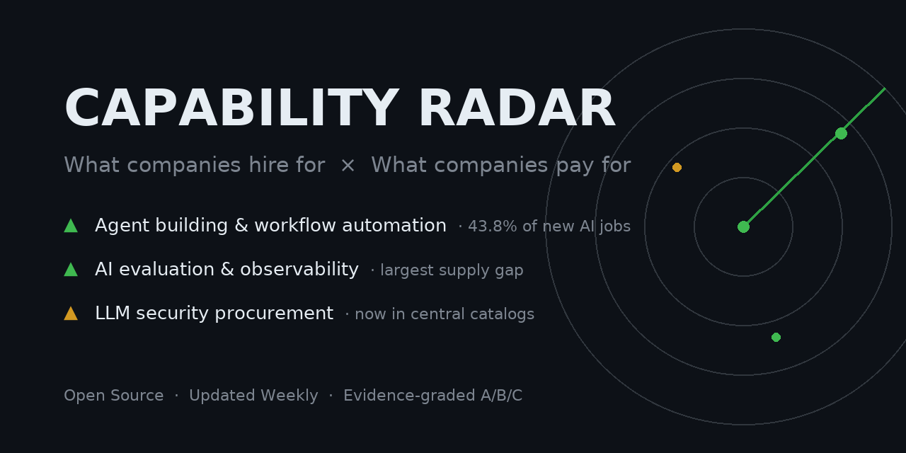

# Capability Radar

**What skills are appreciating? What AI capabilities are companies actually paying for?**
An open-source radar that answers both questions, every week — tracking China's talent and procurement markets.

> 📖 完整中文文档 / Full documentation (in Chinese): [README.md](README.md)

## What it does

- **Two markets, one radar.** The talent market (who companies will pay salaries to) and the procurement market (what companies pay for now — award notices are the most honest transformation data).
- **Momentum, not snapshots.** Every issue is diffed signal-by-signal against the previous one: new / strengthening / fading.
- **Evidence-graded.** Every signal carries an A/B/C grade: A = primary source, click-verifiable; B = authoritative secondary; C = unverified.

## This week's signals (2026-08-13)

| Signal | Momentum | Evidence |
|---|---|---|
| Agent building / workflow automation | ↑ Strongest for 2 consecutive weeks | [B-class applied dev roles = 43.8% of new AI job posts](data/signals/2026-08-13-maimai-b-class-jobs-share.yml) |
| AI evaluation & observability | ↑ Largest employer supply gap | [Report](reports/2026-08-13.md) |
| LLM security procurement (finance/gov) | ↑ Entering centralized procurement catalogs | [Bank of Beijing award notice · Grade A](data/signals/2026-08-13-bank-of-beijing-llm-security-gateway.yml) |

## Create My Radar

This is a **template repository** — you don't fork it, you generate your own:

1. **[Create My Radar](https://github.com/MoonHuang0325/capability-radar/generate)** → edit [radar.yml](radar.yml) (or use a preset from [packs/](packs/))
2. Copy [prompts/weekly-agent-prompt.md](prompts/weekly-agent-prompt.md) into your own AI agent (any agent with web search + scheduled tasks)
3. Set it to run weekly — reports and structured signals accumulate automatically

The repo provides the protocol, configuration, schemas, validation CI, and a watchdog; **your AI agent performs the weekly research run**.

## More

- Evidence-backed transition playbooks per role (CN): [playbooks/](playbooks/)
- Methodology (CN): [docs/methodology.md](docs/methodology.md)
- Data & licensing: code is [MIT](LICENSE); third-party material belongs to its publishers — see [DATA_NOTICE.md](DATA_NOTICE.md)

Author: [@MoonHuang0325](https://github.com/MoonHuang0325)
